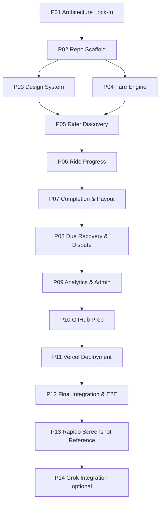

# Assured Pay — Spec-Driven Implementation Plan

**Version:** 0.1  
**Status:** Ready for execution  
**Source of truth:** All files in `/docs` (PRD, ARCHITECTURE, ROADMAP, OPEN_QUESTIONS, etc.)  
**Constraint:** No feature code until Phase P02 begins. This document is the execution contract.

---

## How to use this plan

1. Execute phases **in order** unless noted as parallel-safe.
2. Do not start phase *N+1* until phase *N* **done criteria** are met.
3. Log decisions in `DECISION_LOG.md`; check boxes in `PHASE_CHECKLISTS.md`.
4. Each phase ends with a **Git commit checkpoint** — small, revert-safe history.
5. Settlement logic, API contracts, and KPI events are non-negotiable specs from `/docs`.

---

## Phase dependency graph



**Parallel-safe window:** P03 (Design System) and P04 (Fare Engine) may overlap after P02, but P05 requires both complete.

**Estimated duration (solo, part-time):** 3–4 weeks to P12; +3–5 days for P13–P14.

---

## P01 — Architecture Lock-In

### 1. Objective
Freeze the MVP architecture, accept policy defaults, and produce implementation-ready specs so coding starts without ambiguity.

### 2. Why this phase exists
All `/docs` planning is complete but decisions in `OPEN_QUESTIONS.md` must be explicitly accepted before code. Prevents rework on settlement boundaries, API shapes, and scope creep.

### 3. Frontend tasks
- Confirm route map from `ARCHITECTURE.md` §4.2 (no routes implemented).
- Confirm component inventory: AssuredPayBookingCard, AssuredPayChip, FareUpdateBanner, TripEndSettlement, RecoveryBanner, DiscoveryPrompts, CaptainWalletPanel.
- Confirm FE→BE pattern: direct REST + CORS (`OQ-17` default).
- Document TypeScript API type strategy (hand-sync MVP; OpenAPI later).

### 4. Backend tasks
- Confirm module layout from `ARCHITECTURE.md` §5.2.
- Accept settlement policy defaults into `DECISION_LOG.md` (OQ-1 through OQ-5).
- Confirm PaymentPort / WalletPort interfaces and mock-first adapters.
- Confirm entity list from `ARCHITECTURE.md` §6.2.
- Export API contract checklist from `ARCHITECTURE.md` §7 as build order reference.

### 5. UX/design tasks
- Confirm copy keys for discovery prompts (`DISCOVERY_AND_HABIT.md`).
- Confirm mobile-first breakpoint: 375px primary.
- Confirm neutral app shell until P13 (OQ-20).
- Draft wireframe checklist mapping `USER_JOURNEYS.md` journeys 1–8 to routes.

### 6. Testing tasks
- Map `TEST_STRATEGY.md` pyramid to phases P04–P12.
- Define fixture IDs: `rider_commuter`, `rider_arjun`, `rider_blocked`.
- Define E2E IDs E1–E8 ownership per phase.

### 7. Deliverables
- `DECISION_LOG.md` populated with P01 accepted defaults.
- `PHASE_CHECKLISTS.md` P01 section complete.
- Architecture sign-off note in `DECISION_LOG.md` (date + builder).

### 8. Git commit checkpoint
```
docs: lock architecture defaults and execution plan (P01)
```

### 9. Done criteria
- [ ] All OQ-1–OQ-5 defaults accepted or overridden in `DECISION_LOG.md`
- [ ] No open blocking questions for fare engine or settlement
- [ ] API endpoint list agreed (11 groups from ARCHITECTURE §7)
- [ ] Explicit rule documented: no LLM imports in `backend/app/domain/`

### 10. Key risks
| Risk | Mitigation |
|------|------------|
| Analysis paralysis on thresholds | Use OPEN_QUESTIONS MVP defaults; tune in P08+ |
| Scope creep to auto/cab | Hard-code bike eligibility in spec note |
| Starting code before lock-in | P01 has zero feature code deliverable |

---

## P02 — Repo Scaffold & CI

### 1. Objective
Create monorepo skeleton, tooling, and CI so every subsequent phase commits safely.

### 2. Why this phase exists
Establishes the container for vertical slices. Without scaffold + CI, later phases accumulate untested debt.

### 3. Frontend tasks
- Initialize Next.js 14 App Router in `frontend/` with TypeScript + Tailwind.
- Add ESLint, Prettier, strict TS config.
- Placeholder routes: `/`, `/book` (empty shell).
- Add `NEXT_PUBLIC_API_URL` env example.
- Vitest + RTL configured with one smoke test.

### 4. Backend tasks
- Initialize FastAPI in `backend/` with `GET /health`.
- Add Ruff, Black, pytest, httpx.
- `backend/app/config.py` loading env vars (buffer, policy version).
- Empty module folders per ARCHITECTURE §5.2.
- One health-check integration test.

### 5. UX/design tasks
- Add Tailwind base layout: mobile container, safe-area padding.
- Placeholder typography scale (generic, not Rapido-branded).

### 6. Testing tasks
- GitHub Actions: `backend-test` + `frontend-test` jobs on PR.
- Local dev documented in root `README.md`.

### 7. Deliverables
- Monorepo: `frontend/`, `backend/`, `e2e/` (empty), `.github/workflows/ci.yml`
- Root `README.md` with dual-terminal dev instructions
- `.env.example` files (no secrets)
- `.gitignore` covering node, python, sqlite, design-reference

### 8. Git commit checkpoint
```
chore: scaffold monorepo with FastAPI, Next.js, and CI (P02)
```

### 9. Done criteria
- [ ] `npm run dev` serves `/book` placeholder
- [ ] `uvicorn` serves `/health` → 200
- [ ] CI green on push to main
- [ ] No feature/business logic beyond health check

### 10. Key risks
| Risk | Mitigation |
|------|------------|
| Monorepo path confusion | Document roots in README |
| CI flakiness | Minimal jobs first; expand in P04+ |
| Windows path issues | Use documented PowerShell commands |

---

## P03 — Frontend Design System

### 1. Objective
Build reusable, mobile-first UI primitives and feature-agnostic layout patterns before Assured Pay feature UI.

### 2. Why this phase exists
Feature phases (P05–P08) move faster with shared components. Generic tokens now avoid rework when P13 applies Rapido visual reference.

### 3. Frontend tasks
- Tailwind theme tokens: color, spacing, radius, shadow, font scale.
- Base components: `Button`, `Card`, `Chip`, `Banner`, `Modal`, `Skeleton`, `FareAmount`.
- Layout: `MobileShell`, `PageHeader`, `Section`.
- `data-testid` convention documented and applied to base components.
- Story-less component gallery page at `/design-system` (dev-only route).

### 4. Backend tasks
- None (phase isolation).

### 5. UX/design tasks
- Define fare display format: `₹{amount}` with 2 decimal consistency.
- Status color semantics: success (green), warning (buffer), alert (exceeds M), neutral.
- CTA hierarchy: primary opt-in, secondary “How fare changes work”.
- Accessibility: focus rings, 44px min touch targets, contrast on fare text.

### 6. Testing tasks
- Vitest tests for Button, Card, Chip, FareAmount render variants.
- Snapshot optional; prefer assertion on text/roles.

### 7. Deliverables
- `frontend/src/components/ui/*` (or equivalent)
- `/design-system` internal gallery route
- Component test suite green

### 8. Git commit checkpoint
```
feat(ui): add mobile-first design system primitives (P03)
```

### 9. Done criteria
- [ ] All P0 feature components can be composed from design system (no feature logic yet)
- [ ] 375px layout verified manually
- [ ] Vitest green for ui components
- [ ] No Rapido-branded assets (neutral palette)

### 10. Key risks
| Risk | Mitigation |
|------|------------|
| Over-building design system | Only components listed in ARCHITECTURE §4.4 + base set |
| Premature Rapido styling | Explicitly deferred to P13 |

---

## P04 — Fare Engine

### 1. Objective
Implement deterministic fare estimation (F), in-ride fare accumulation (A), buffer/M calculation, and settlement rules engine — the domain core.

### 2. Why this phase exists
All Assured Pay value depends on correct F, M, A logic. Must exist and be fully unit-tested before UI or orchestration layers.

### 3. Frontend tasks
- None required (optional: type definitions for fare DTOs mirroring backend schemas).

### 4. Backend tasks
- `domain/fare.py`: estimate F (distance + time formula MVP); compute M = F + buffer.
- `domain/reason_codes.py`: WAITING, ROUTE_CHANGE, TOLL, PICKUP_CORRECTION.
- `domain/settlement.py`: rules engine → SettlementDecision (FULL_CAPTURE, RESIDUAL_CREATED, REVIEW_REQUIRED).
- `domain/eligibility.py`: bike, city, instrument, residual block checks.
- `rules/settlement_rules.yaml` with policy version.
- `POST /rides/estimate`, fare event model prep.
- Parametrized pytest matrix per TEST_STRATEGY §3.1 (≥95% domain coverage).

### 5. UX/design tasks
- Document reason-code → rider message mapping table for P06 UI.
- Confirm zone labels: WITHIN_ESTIMATE, IN_BUFFER, EXCEEDS_M.

### 6. Testing tasks
- pytest domain: all A vs M cases + boundaries (A=M, excess=10, excess=25).
- Test policy_version appears in every SettlementDecision.
- Negative test: no external/LLM dependencies in domain module.

### 7. Deliverables
- Pure domain modules with full unit tests
- `settlement_rules.yaml` committed
- Fare estimate API stub (can return fixed F for demo coords initially)

### 8. Git commit checkpoint
```
feat(domain): fare engine and settlement rules with full unit tests (P04)
```

### 9. Done criteria
- [ ] All TEST_STRATEGY §3.1 cases pass
- [ ] Decisions match PRD §3.1 logic exactly
- [ ] OQ-1–OQ-5 reflected in rules config
- [ ] OpenAPI/docstring records formula: M = F + 7 (configurable)

### 10. Key risks
| Risk | Mitigation |
|------|------------|
| R10 AI in settlement | Lint/rule: no openai/xai imports in domain |
| Wrong boundary thresholds | Parametrize tests from yaml config |
| Fare formula complexity | MVP: simple deterministic formula + reason deltas |

---

## P05 — Rider Discovery

### 1. Objective
Ship eligibility, opt-in authorization, booking UI, and contextual discovery entry points.

### 2. Why this phase exists
Assured Pay is opt-in. Riders must see F/M, understand value, and authorize before ride starts — core product contract.

### 3. Frontend tasks
- API client + TanStack Query setup.
- `/book`: fare estimate, AssuredPayBookingCard, opt-in CTA, confirmation state.
- “How fare changes work” modal (static copy from DISCOVERY_AND_HABIT).
- DiscoveryPrompts: booking card (always), low-battery stub, online-payer stub.
- Hook: `useAssuredPayEligibility`.
- Payment instrument selector (mock list from API).

### 4. Backend tasks
- SQLite models: Rider, PaymentInstrument, Ride, AssuredPayAuthorization, RiderAssuredProfile.
- `GET /assured-pay/eligibility`, `POST /assured-pay/authorize`.
- `POST /rides`, `POST /rides/estimate`.
- DiscoveryService: rule-based prompts (battery flag param, online payer history, post-failure flag).
- Seed script: rider_commuter, rider_arjun, rider_blocked.
- Integration tests for eligibility + authorize.

### 5. UX/design tasks
- Booking card layout per DISCOVERY_AND_HABIT §3 anatomy.
- Confirmation copy: captain payout guaranteed + link.
- Free trial badge when `free_trial_available`.
- Ineligible states with clear reason (open residual, no instrument, not bike).

### 6. Testing tasks
- API integration: eligible, blocked, duplicate authorize.
- RTL: AssuredPayBookingCard renders F/M; CTA disabled when ineligible.
- Manual: opt-in creates authorization record.

### 7. Deliverables
- End-to-end booking opt-in flow (ride created, assured active)
- Discovery attribution on authorize (`discovery_source`)
- Seed data script

### 8. Git commit checkpoint
```
feat: rider discovery, eligibility API, and booking opt-in UI (P05)
```

### 9. Done criteria
- [ ] Rider can estimate fare, opt in, create assured ride
- [ ] F and M visible before consent
- [ ] At least 2 discovery entry points wired (booking card + one contextual)
- [ ] Integration tests green

### 10. Key risks
| Risk | Mitigation |
|------|------------|
| R1 hidden charges perception | F/M mandatory before CTA enable |
| Client-side M calculation | Server returns M; client displays only |
| R5 category creep | Eligibility rejects non-bike |

---

## P06 — Ride Progress

### 1. Objective
In-ride fare monitoring: live fare status, reason-coded updates, buffer zone indicator.

### 2. Why this phase exists
Transparency during ride prevents end-of-trip surprises — product principle #1. Supports “still covered under ₹M” messaging.

### 3. Frontend tasks
- `/ride/[rideId]`: AssuredPayChip, FareUpdateBanner.
- Poll or refetch `GET /rides/{id}/fare-status` via TanStack Query.
- Zone UI: within estimate / in buffer / exceeds M warning.
- Navigate to complete flow trigger (End ride demo button).

### 4. Backend tasks
- FareEvent model + `POST /rides/{id}/fare-events` (demo/test).
- `GET /rides/{id}/fare-status` computing current_fare, zone, reason_codes.
- Fare accumulation: F + sum(reason deltas) → current A preview.
- Integration tests: WITHIN_ESTIMATE, IN_BUFFER, EXCEEDS_M zones.

### 5. UX/design tasks
- In-ride chip: “Assured Pay active”.
- Fare update copy: “Fare updated to ₹46 due to 3 min waiting”.
- Buffer reassurance: “Still covered under your approved max ₹49”.
- Exceeds M: non-alarmist warning, sets expectation for trip end.

### 6. Testing tasks
- API: fare event updates zone correctly.
- RTL: AssuredPayChip zone labels.
- Manual journey 3 from USER_JOURNEYS (waiting within buffer).

### 7. Deliverables
- In-ride page functional against local API
- Demo ability to apply WAITING fare event

### 8. Git commit checkpoint
```
feat: in-ride fare status, zones, and fare event API (P06)
```

### 9. Done criteria
- [ ] Live fare updates reflect in UI within one refetch cycle
- [ ] Reason codes display human-readable messages
- [ ] EXCEEDS_M state visible before trip end
- [ ] Integration tests green

### 10. Key risks
| Risk | Mitigation |
|------|------------|
| Stale fare display | Query refetch interval + manual invalidate on event |
| Captain-side scope creep | Rider-only UI this phase |

---

## P07 — Completion & Payout

### 1. Objective
Trip-end settlement orchestration, payment mock, captain wallet credit, and rider trip-end UX.

### 2. Why this phase exists
Core North Star moment: frictionless completion + captain payout certainty. Implements PRD settlement rules in orchestrated flow.

### 3. Frontend tasks
- `/ride/[rideId]/complete`: TripEndSettlement (success, residual, review preview states fed by API).
- `/captain`: CaptainWalletPanel stub — balance + transaction list.
- Post-ride reinforcement toast: “You skipped payment friction…”
- `/demo` toggles: simulate_payment_failure, complete ride.

### 4. Backend tasks
- Models: Settlement, CaptainWalletTransaction.
- Ports: PaymentPort, WalletPort interfaces.
- Adapters: MockPaymentService, MockWalletService.
- TripEndOrchestrator per ARCHITECTURE §5.4.
- `POST /rides/{id}/complete` with idempotency key support.
- `GET /captains/{id}/wallet`, ride settlement detail.
- Service tests: orchestration order, idempotent complete.
- Integration tests: full capture, payment fail rescue, captain credit.

### 5. UX/design tasks
- Trip end success: “Ride complete. ₹46 paid automatically.”
- Payment rescue messaging (Assured Pay saved the ride).
- Captain wallet: assured badge, +₹ amount, timestamp.
- Loading/error states on complete.

### 6. Testing tasks
- TEST_STRATEGY §3.2 service layer tests.
- API complete: success + simulate_payment_failure.
- RTL: TripEndSettlement three variants.
- E3 partial (payment failure rescue) — prep for P12.

### 7. Deliverables
- Full happy path: opt-in → ride → complete → captain credited
- Payment failure rescue path working
- Mock adapters swappable via config

### 8. Git commit checkpoint
```
feat: trip-end settlement, payment/wallet mocks, captain wallet UI (P07)
```

### 9. Done criteria
- [ ] A ≤ M + payment ok → FULL_CAPTURE, captain credited A
- [ ] Payment fail + assured → ride completes, captain credited (E3)
- [ ] Idempotent complete (no double credit)
- [ ] Captain wallet visible within 2s of complete (local)

### 10. Key risks
| Risk | Mitigation |
|------|------------|
| R3 captain distrust | Instant wallet credit + visible transaction |
| R10 AI in settlement | Orchestrator calls domain only |
| Double payout | Idempotency-Key + unique settlement per ride |

---

## P08 — Due Recovery & Dispute

### 1. Objective
Residual due lifecycle, recovery UX, review queue for suspicious overages, ops resolution flow.

### 2. Why this phase exists
Implements bounded platform risk: small valid overages create residual; large/suspicious routes to human review — not silent finalization.

### 3. Frontend tasks
- TripEndSettlement: full residual + review states.
- `/recovery`: RecoveryBanner, pay flow, breakdown.
- `/history`: post-failure education card (rider_arjun seed).
- `/ops/review`: queue list, case detail, resolve action.
- Block Assured Pay opt-in when open residual (surface on /book).

### 4. Backend tasks
- Models: ResidualDue, ReviewCase.
- `GET /riders/{id}/residuals/open`, `POST /residuals/{id}/pay`.
- `GET /ops/review-queue`, `POST /ops/review/{case_id}/resolve`.
- Review path: credit M immediately; hold (A−M) per OQ-5.
- Residual block policy: 2 unpaid past 7d → assured_blocked (OQ-7).
- Integration tests: residual create/pay, review routing, eligibility block.

### 5. UX/design tasks
- Residual copy: “₹49 captured. ₹3 due — verified waiting charge.”
- Recovery: dignified tone, no shame (DISCOVERY_AND_HABIT).
- Review pending: clear next steps, reason breakdown.
- Ops resolve: decision labels APPROVE_RESIDUAL / ADJUST / DENY.

### 6. Testing tasks
- Domain + API: A>M small valid → RESIDUAL_CREATED; large → REVIEW_REQUIRED.
- RTL: RecoveryBanner, review pending state.
- E4, E5, E6, E7 prep scenarios.

### 7. Deliverables
- Residual create → pay → eligibility restored
- Review case created and resolvable from ops UI
- Education card on history for post-failure rider

### 8. Git commit checkpoint
```
feat: residual recovery, review queue, and dispute flows (P08)
```

### 9. Done criteria
- [ ] Small valid overage creates residual; captain gets full A
- [ ] Suspicious overage creates review case; no silent finalize
- [ ] Open residual blocks Assured Pay opt-in
- [ ] Ops can resolve case with audit trail

### 10. Key risks
| Risk | Mitigation |
|------|------------|
| R2 bad debt | Block policy + explicit recovery UX |
| R1 trapped rider feeling | Reason breakdown always visible |
| Ops UI scope creep | Minimal queue + resolve only |

---

## P09 — Analytics & Admin

### 1. Objective
Instrument KPI events, metrics summary API, habit loop features, and demo/admin tooling.

### 2. Why this phase exists
North Star (FACR) must be measurable for demo credibility. Habit formation and discovery attribution prove product thesis beyond single rides.

### 3. Frontend tasks
- `/demo`: rider selector, battery toggle, payment fail, apply overage, reset seed.
- Habit prompts: free trial consumption UI, “Always use Assured Pay” after 3 rides.
- Optional `/metrics` admin page calling summary API.
- Emit client-side events where backend cannot (discovery impressions).

### 4. Backend tasks
- MetricsEvent model; append-only insert.
- Emit events per KPI_TREE taxonomy (assured_opt_in, trip_end_settlement, etc.).
- `POST /metrics/events`, `GET /metrics/summary` (FACR, opt-in rate, rescue rate stubs).
- RiderAssuredProfile: success_streak, always_assured, free_trial flags.
- Discovery: commute banner rule (≥5 rides / 14d seed simulation).

### 5. UX/design tasks
- Post-ride reinforcement copy (habit step 2).
- Always-on prompt modal (habit step 3).
- Zero-failure streak display (optional chip).
- Metrics page: simple tables, not production analytics.

### 6. Testing tasks
- Verify events emitted on opt-in, complete, residual, review.
- Summary API returns computed FACR from seed events.
- E2, E8 prep scenarios.

### 7. Deliverables
- KPI events flowing to DB
- `/metrics/summary` demonstrating FACR calculation
- `/demo` page for stakeholder toggles
- Habit loop prompts functional

### 8. Git commit checkpoint
```
feat: KPI event instrumentation, metrics summary, and demo admin (P09)
```

### 9. Done criteria
- [ ] FACR computable from events
- [ ] discovery_source on opt-in events
- [ ] Free trial + always-on prompts work
- [ ] Demo page controls payment fail and overage scenarios

### 10. Key risks
| Risk | Mitigation |
|------|------------|
| Over-instrumentation | Stick to KPI_TREE event list only |
| R4 battery-saver-only positioning | Commute/convenience discovery live |

---

## P10 — GitHub Prep

### 1. Objective
Prepare repository for public/collaborative development: hygiene, branch policy, README, CI hardening.

### 2. Why this phase exists
Clean GitHub state before deployment reduces embarrassment and enables preview PR workflows.

### 3. Frontend tasks
- `npm run build` passes with no errors.
- Remove or gate `/design-system` and `/demo` for production via env flag.
- Add CI badge placeholder to README.

### 4. Backend tasks
- OpenAPI JSON export committed to `backend/openapi.json` or generated in CI.
- Lock dependency versions (requirements.txt or poetry.lock / package-lock).
- Seed script documented for deploy init.

### 5. UX/design tasks
- README includes 5-minute demo script from ROADMAP §14.
- Screenshots of generic UI (not Rapido) for README optional.

### 6. Testing tasks
- CI required checks documented in README.
- Full pytest + vitest green.
- Playwright config present (tests may run in P12).

### 7. Deliverables
- Clean repo: no secrets, no `.env` committed
- Branch model: `main`, `feat/*`, PR → CI
- CONTRIBUTING.md optional one-pager
- Tag strategy: `v0.1.0-mvp` after P11

### 8. Git commit checkpoint
```
chore: GitHub prep — README, OpenAPI export, CI hardening (P10)
```

### 9. Done criteria
- [ ] Repo push-ready; .gitignore verified
- [ ] CI green on main
- [ ] README documents local dev + demo script
- [ ] No secrets in git history (manual scan)

### 10. Key risks
| Risk | Mitigation |
|------|------------|
| Secret leak | .env.example only; pre-push checklist |
| Large artifact commit | Gitignore sqlite, node_modules, design-reference |

---

## P11 — Vercel Deployment

### 1. Objective
Deploy frontend to Vercel and backend to Railway (default), with Postgres, CORS, and env configuration.

### 2. Why this phase exists
Shareable demo URL is a prototype success criterion. Validates real networking, env vars, and CORS — not just localhost.

### 3. Frontend tasks
- Connect repo to Vercel; root `frontend`.
- Set `NEXT_PUBLIC_API_URL` for production + preview.
- Verify preview deployments on PR.
- Optional: `NEXT_PUBLIC_DEMO_MODE=false` on production.

### 4. Backend tasks
- Deploy FastAPI to Railway; root `backend`.
- Postgres addon; run migrations/seed on deploy.
- `CORS_ORIGINS` includes Vercel prod + preview URLs.
- `GET /health` monitored.
- Run seed script on staging/prod once.

### 5. UX/design tasks
- Smoke test all routes on mobile viewport on prod URL.
- Verify fonts/assets load on Vercel CDN.

### 6. Testing tasks
- Manual post-deploy checklist from ROADMAP §8.
- Preview URL: booking + complete happy path.
- Production URL: payment failure rescue (E3).

### 7. Deliverables
- Production Vercel URL documented in README
- Backend API URL documented
- Deploy runbook in README or `docs/DEPLOY.md` one-section

### 8. Git commit checkpoint
```
chore: add deployment config for Vercel and Railway (P11)
```
(Separate commit from app code if using platform config files.)

### 9. Done criteria
- [ ] Vercel prod loads `/book`
- [ ] Frontend reaches backend API successfully
- [ ] Captain wallet on prod after complete
- [ ] No secrets in client bundle
- [ ] Tag `v0.1.0-mvp` optional here

### 10. Key risks
| Risk | Mitigation |
|------|------------|
| R8 CORS/env misconfig | Explicit origin list; health check first |
| SQLite on cloud | Postgres on Railway per OQ-19 |
| Preview/prod API mismatch | Document env strategy |

---

## P12 — Final Integration & E2E

### 1. Objective
Full Playwright E2E suite, contract alignment, error states, accessibility pass — prove MVP on deployed URL.

### 2. Why this phase exists
Unit/integration tests are insufficient for cross-layer confidence. E1–E8 on prod/preview is definition-of-done per ROADMAP §12.

### 3. Frontend tasks
- Loading skeletons on `/book` and trip complete.
- Error states: API down, ineligible, network error.
- `data-testid` on all E2E-critical elements.
- a11y: keyboard opt-in CTA, fare contrast.

### 4. Backend tasks
- Contract test fixtures in shared `fixtures/` JSON.
- Fix any API drift found by E2E.
- Rate-limit complete endpoint stub (optional).

### 5. UX/design tasks
- Manual QA checklist TEST_STRATEGY §8 all items.
- 5-minute demo rehearsal on prod URL.

### 6. Testing tasks
- Playwright E1–E8 green against deployed stack (or docker-compose CI).
- E2E on merge to main in GitHub Actions.
- Fix flakiness (no arbitrary sleep).

### 7. Deliverables
- `e2e/` suite complete
- CI job `e2e` on main
- All P0 bugs closed

### 8. Git commit checkpoint
```
test: add Playwright E2E suite E1-E8 and fix integration issues (P12)
```

### 9. Done criteria
- [ ] E1–E8 pass on preview or prod URL
- [ ] CI green including E2E on main
- [ ] Manual QA checklist complete
- [ ] README demo script validated end-to-end

### 10. Key risks
| Risk | Mitigation |
|------|------------|
| E2E flakiness | data-testid + webServer wait |
| R7 contract drift | Fix in same PR as API change |
| Prod test pollution | Dedicated seed riders; reset script |

---

## P13 — Rapido Screenshot Reference

### 1. Objective
Apply Rapido-*inspired* visual fidelity to UI using screenshot references — **UI only**, no logic changes.

### 2. Why this phase exists
Per ROADMAP §9: high-fidelity look increases stakeholder trust **after** functional MVP is deployed and E2E-proven.

### 3. Frontend tasks
- Collect 5–8 reference screenshots → `frontend/design-reference/` (gitignored per OQ-21).
- Update Tailwind tokens: yellow/black accent approximation, typography.
- Refactor booking, in-ride, trip-end, wallet layouts to match references.
- Neutral or “RapidDemo” logo — no verbatim Rapido trademark assets.
- Re-run Vitest; fix layout regressions.

### 4. Backend tasks
- None (explicit freeze on settlement/API this phase).

### 5. UX/design tasks
- Side-by-side review: reference vs implementation.
- PM sign-off on transparency elements still visible (F, M, reason codes).
- Night/safety copy variant optional on discovery cards.

### 6. Testing tasks
- E1–E8 re-run after UI refactor — must stay green.
- Manual mobile visual pass 375px.
- Optional Playwright screenshot compare (non-blocking).

### 7. Deliverables
- Rapido-inspired theme applied
- design-reference folder gitignored
- Visual review sign-off note in DECISION_LOG

### 8. Git commit checkpoint
```
style: apply Rapido-inspired visual reference to rider flows (P13)
```

### 9. Done criteria
- [ ] E2E still green post-refactor
- [ ] F/M/reason codes still prominent (R1 guardrail)
- [ ] No proprietary assets committed
- [ ] Stakeholder visual review passed

### 10. Key risks
| Risk | Mitigation |
|------|------------|
| R11 copyright | gitignore references; inspired-by not copy |
| UI refactor breaks tests | E2E immediately after |
| Pixel-chasing delays ship | Time-box 2–3 days |

---

## P14 — Grok Integration (Optional)

### 1. Objective
Add feature-flagged Grok API for copy variants and ops summarization — **never** settlement decisions.

### 2. Why this phase exists
Per ROADMAP §10: optional acceleration for copy iteration after MVP is stable and deployed.

### 3. Frontend tasks
- Display Grok-generated copy only when validated server-side.
- Fallback to static copy keys on API failure.
- Admin toggle visible only in demo mode.

### 4. Backend tasks
- `GROK_API_KEY` env; `GROK_COPY_ENABLED=false` default.
- `/api/v1/copy/generate` — input: structured reason_codes + amounts; output: validated text only.
- `/api/v1/ops/summarize` — review case summary for ops (human decides).
- Output validator: max length, regex reject currency amounts from LLM output.
- No Grok imports in `domain/` or settlement orchestrator.

### 5. UX/design tasks
- Review Grok copy for tone (trust, not hype).
- A/B discovery copy variants documented.

### 6. Testing tests
- Mock Grok responses; test fallback when disabled/fails.
- Test validator rejects hallucinated amounts.
- Confirm settlement tests unchanged.

### 7. Deliverables
- Grok adapter behind feature flag
- Copy generation endpoint with validation
- Ops summarize endpoint (optional)

### 8. Git commit checkpoint
```
feat: optional Grok copy assist behind feature flag (P14)
```

### 9. Done criteria
- [ ] `GROK_COPY_ENABLED=false` → app identical to P13 behavior
- [ ] No settlement test changes
- [ ] Validator blocks amount hallucination
- [ ] API key not in client

### 10. Key risks
| Risk | Mitigation |
|------|------------|
| R12 Grok hallucinated amounts | Server-side validator + static fallback |
| R10 AI in payments | Grok isolated to copy module |
| Free tier rate limits | Cache responses; default off |

---

## Self-check: logical order & feasibility

| Check | Status |
|-------|--------|
| Domain before orchestration | P04 before P07 ✓ |
| Design system before feature UI | P03 before P05 ✓ |
| Opt-in before in-ride | P05 before P06 ✓ |
| Complete before residual/review | P07 before P08 ✓ |
| Metrics after flows exist | P09 after P08 ✓ |
| Deploy after feature complete | P11 after P09 ✓ |
| E2E after deploy | P12 after P11 ✓ |
| Screenshots after E2E baseline | P13 after P12 ✓ |
| Grok last and optional | P14 after P13 ✓ |
| Each phase independently committable | Small scope per phase ✓ |
| Solo builder feasible | 1–3 day phases, vertical slices ✓ |

---

## Related documents

| Doc | Role |
|-----|------|
| `PHASE_CHECKLISTS.md` | Checkbox tracker per phase |
| `DECISION_LOG.md` | Accepted decisions and overrides |
| `ARCHITECTURE.md` | API and module specs |
| `TEST_STRATEGY.md` | Test cases per layer |
| `ROADMAP.md` | Original phase mapping (P01–P14 supersedes for execution) |
